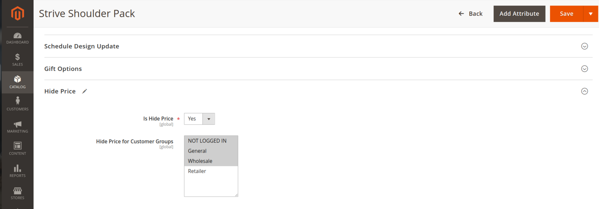
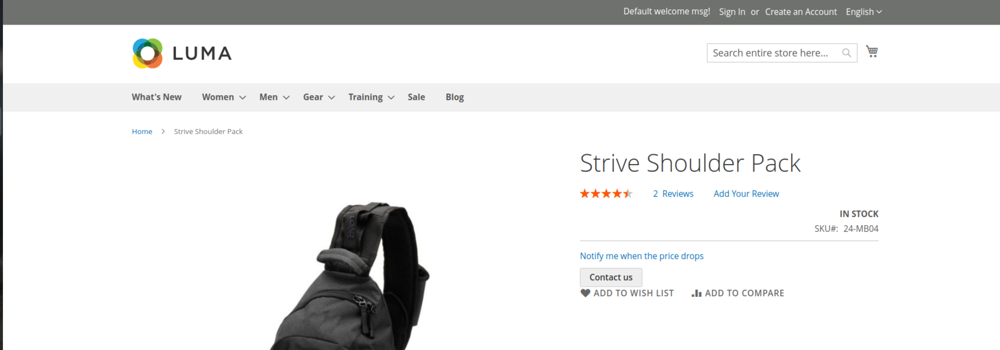
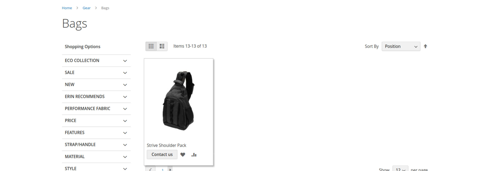
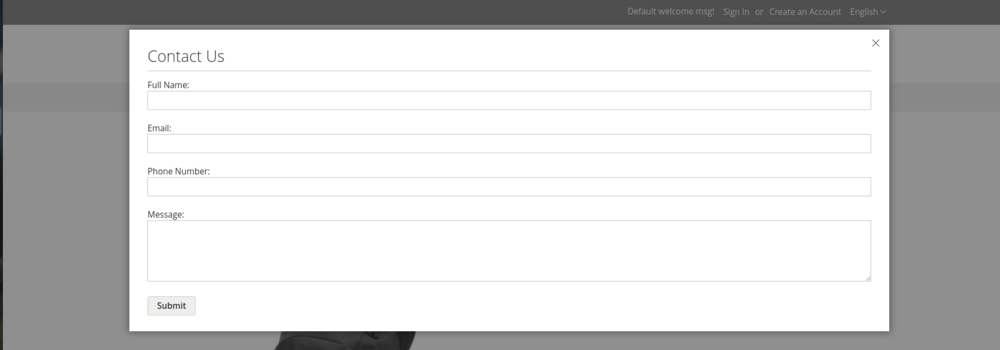

# Thao_HidePrice

Magento 2 module for hiding product prices based on customer groups or other conditions.

## System Requirements

- Magento 2.4+
- PHP 7.4+

## Installation

### Install via Composer

1. Add the repository to Composer:
   ```sh
   composer config repositories.thao/module-hide-price git https://github.com/Tothao/Thao_HidePrice.git
   ```
2. Install the module:
   ```sh
   composer require thao/module-hide-price:dev-master
   ```
3. Run the following commands to enable the module:
   ```sh
   php bin/magento setup:upgrade
   php bin/magento setup:di:compile
   php bin/magento cache:flush
   ```

### Manual Installation

1. Clone the module from GitHub:
   ```sh
   git clone https://github.com/Tothao/Thao_HidePrice.git app/code/Thao/HidePrice
   ```
2. Run the following commands to enable the module:
   ```sh
   php bin/magento setup:upgrade
   php bin/magento setup:di:compile
   php bin/magento cache:flush
   ```

## Configuration

### How to Configure Hide Price for Products
Go to the product edit page in the admin panel and configure the **Is Hide Price** and **Hide Price for Customer Groups** attributes.



### Hide price in product page



### Hide price in product list



### Show popup contact to admin



## Support

If you encounter any issues or have questions, please create an issue on the module's GitHub repository.

## License

This module is released under the MIT license.
